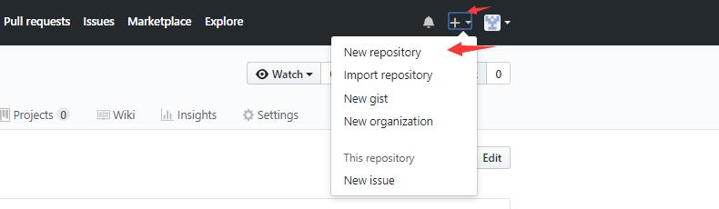
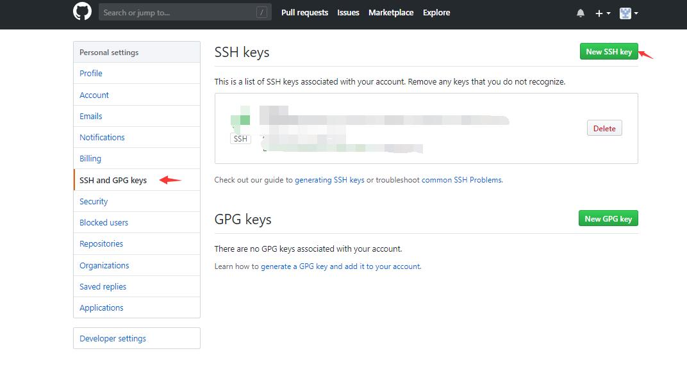
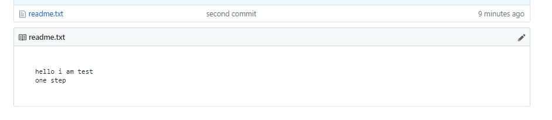

# git教程

### 一、配置git

1、注册github账号，登录github

2、在线新建repository(仓库)

	点击右上角+号



3、安装Git，启动git-bash.exe

4、本地创建ssh key，执行命令

```
$ ssh-keygen -t rsa -C "your_email@youremail.com"
```

	成功的话会在当前用户根目录下生成`.ssh`文件夹，进去，打开`id_rsa.pub`，复制里面的key

5、github添加ssh key

	回到github上，进入 Account Settings（账户配置），左边选择SSH Keys，Add SSH Key,title随便填，粘贴在你电脑上生成的key



6、验证是否成功，在git bash下输入：

```
$ ssh -T git@github.com
```

	如果是第一次的会提示是否continue，输入yes就会看到：You've successfully authenticated, but GitHub does not provide shell access 。这就表示已成功连上github。

7、设置远程github的username和email

```
$ git config --global user.name "your name"
$ git config --global user.email "your_email@youremail.com"
```

### 二、本地创建和管理项目

1、在本地目录中创建Git仓库，比如创建一个test仓库

```
$ mkdir test
$ cd test
$ git init
Initialized empty Git repository in D:/SoftWare/Git/Git/Github/test/.git/
$ ls -a   
./  ../  .git/
```

2、拷贝一个 远程Git 仓库到本地

```
$ git clone [url]
#url可以是git@github.com:username/test.git，也可以是https://github.com/username/test.git
```

3、将文件添加到缓存

	在test仓库中新建readme.txt文件，查看文件状态（git status，-s参数是获得简短的结果输出）

```
git add 命令可将该文件添加到缓存，如我们添加以下两个文件
$ touch README
$ touch hello.php
$ ls
README        hello.php

git status 命令用于查看项目的当前状态
$ git status -s
?? README
?? hello.php

接下来我们执行 git add 命令来添加文件：
$ git add README hello.php 

现在我们再执行 git status，就可以看到这两个文件已经加上去了。
$ git status -s
A  README
A  hello.php

现在我们修改 README 文件：
$ vim README
在 README 添加以下内容：# Runoob Git 测试，然后保存退出。

再执行一下 git status：
$ git status -s
AM README
A  hello.php
"AM" 状态的意思是，这个文件在我们将它添加到缓存之后又有改动。改动后我们再执行 git add 命令将其添加到缓存中：

新项目中，添加所有文件很普遍，我们可以使用 git add . 命令来添加当前项目的所有文件。

$ git add .
$ git status -s
A  README
A  hello.php
```

4、查看改动信息

```
#git status 以查看在你上次提交之后是否有修改
#执行 git diff 来查看执行 git status 的结果的详细信息
#尚未缓存的改动：git diff
#查看已缓存的改动： git diff --cached
#查看已缓存的与未缓存的所有改动：git diff HEAD
#显示摘要而非整个 diff：git diff --stat
$ git diff --cached
diff --git a/readme.txt b/readme.txt
new file mode 100644
index 0000000..31e7680
--- /dev/null
+++ b/readme.txt
@@ -0,0 +1 @@
+hello i am test
```

5、提交缓存区内容到仓库

```
#执行 git commit 将缓存区内容添加到仓库中
$ git commit -m 'first commit'
[master (root-commit) 20e5075] first commit
 1 file changed, 1 insertion(+)
 create mode 100644 readme.txt
#使用 -m 选项以在命令行中提供提交注释
#如果没有设置 -m 选项，Git 会尝试为你打开一个编辑器以填写提交信息
#现在我们已经记录了快照。如果我们再执行 git status:
$ git status
On branch master
nothing to commit, working tree clean
#说明我们在最近一次提交之后，没有做任何改动
```

6、简化一步提交

```
#如果你觉得 git add 提交缓存的流程太过繁琐，Git 也允许你用 -a 选项跳过这一步
#我们先修改readme.txt的内容，添加一句 one step
$ vim readme.txt
#执行命令
$ git commit -am 'second commit'
warning: LF will be replaced by CRLF in readme.txt.
The file will have its original line endings in your working directory.
[master 4978eb9] second commit
 1 file changed, 1 insertion(+)
```

### 上传项目到github

1、关联远程仓库

```
$ git remote add origin git@github.com:username/test.git
```

2、把本地库的所有内容推送到远程库上

```
$ git push -u origin master
ERROR: Repository not found.
fatal: Could not read from remote repository.

Please make sure you have the correct access rights
and the repository exists.
#注意要现在github上创建仓库
#在github上创建仓库之后，执行命令
$ git push -u origin master
Enumerating objects: 6, done.
Counting objects: 100% (6/6), done.
Delta compression using up to 8 threads.
Compressing objects: 100% (2/2), done.
Writing objects: 100% (6/6), 463 bytes | 231.00 KiB/s, done.
Total 6 (delta 0), reused 0 (delta 0)
To github.com:black-mirror/test.git
 * [new branch]      master -> master
Branch 'master' set up to track remote branch 'master' from 'origin'.
```

	在github中查看



3、快速上传代码到github，命令小节

```
git init //把这个目录变成Git可以管理的仓库

git add README.md //文件添加到仓库

git add . //不但可以跟单一文件，还可以跟通配符，更可以跟目录。一个点就把当前目录下所有未追踪的文件全部add了 

git commit -m "first commit" //把文件提交到仓库
git remote add origin git@github.com:wangjiax9/practice.git //关联远程仓库

git push -u origin master //把本地库的所有内容推送到远程库上
```

### Git其他命令

1、git reset HEAD

	git reset HEAD 命令用于取消已缓存的内容

```
#我们先改动文件test1.txt和test2.txt文件
#两个文件修改后，都提交到了缓存区，我们现在要取消其中一个的缓存
$ git add .
$ git status -s
M  test1.txt
M  test2.txt
$ git reset HEAD test1.txt 
Unstaged changes after reset:
M  test1.txt
#执行 git commit，只会将 test2.txt 文件的改动提交，而 test1.txt 是没有的
#执行 git reset HEAD 以取消之前 git add 添加，但不希望包含在下一提交快照中的缓存
```

2、git rm

	要从 Git 中移除某个文件，就必须要从已跟踪文件清单中移除，然后提交

```
从 Git 中移除某个文件
git rm <file>

如果删除之前修改过并且已经放到暂存区域的话，则必须要用强制删除选项 -f
git rm -f <file>

如果把文件从暂存区域移除，但仍然希望保留在当前工作目录中，换句话说，仅是从跟踪清单中删除，使用 --cached 选项即可
git rm --cached <file>

如我们删除 hello.php文件：
$ git rm hello.php 
rm 'hello.php'
$ ls
README

不从工作区中删除文件：
$ git rm --cached README 
rm 'README'
$ ls
README

可以递归删除，即如果后面跟的是一个目录做为参数，则会递归删除整个目录中的所有子目录和文件：
git rm –r * 
```

3、git mv

```
git mv 命令用于移动或重命名一个文件、目录、软连接。

我们先把刚移除的 README 添加回来：

$ git add README 
然后对其重名:

$ git mv README  README.md
$ ls
README.md
```

